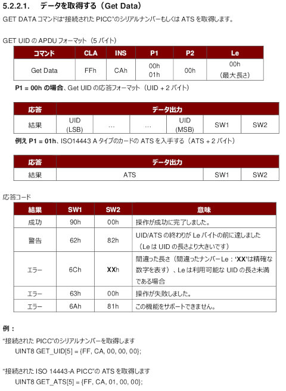
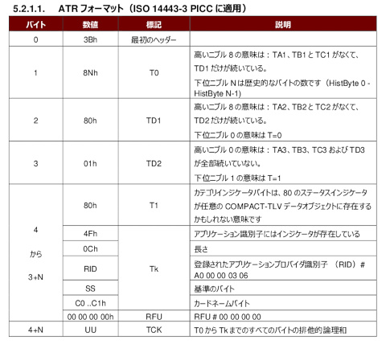
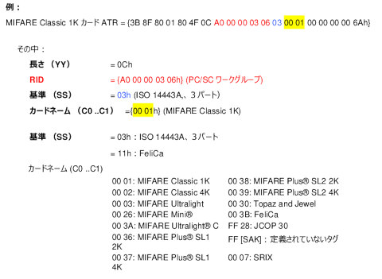
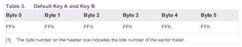
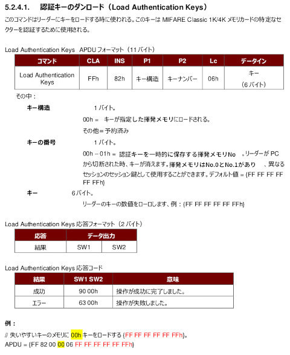
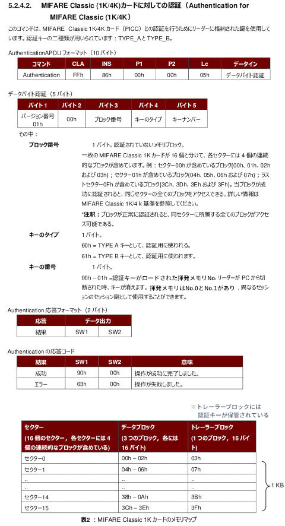
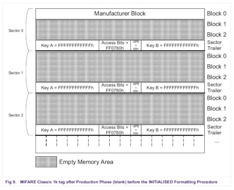
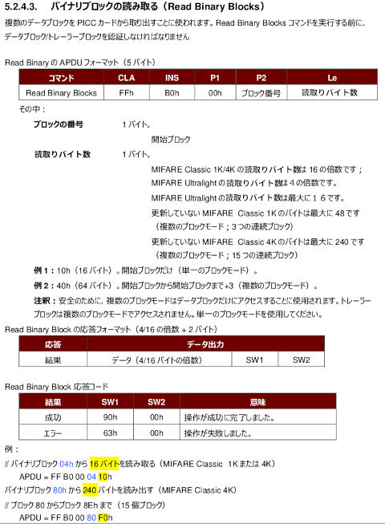
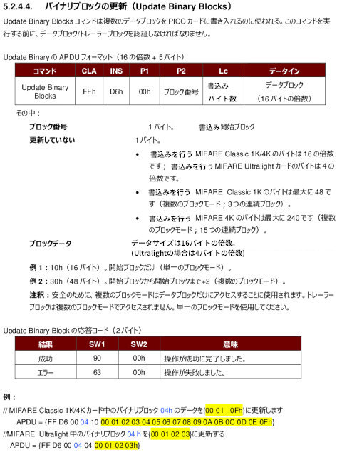

## RFID (非接触ICタグ) 読み書き

Python [pyscard](https://pyscard.sourceforge.io/) PC/SCライブラリを用いて、MIFAREとFeliCaカードを読み書きするスクリプトのプロトタイプ

- [RFID (非接触ICタグ) 読み書き](#rfid-非接触icタグ-読み書き)
  - [01\_UID読み取り\_簡易版.py スクリプト (UID/ATSの読取り)](#01_uid読み取り_簡易版py-スクリプト-uidatsの読取り)
    - [実行例](#実行例)
    - [Get Dataコマンド(UID/ATS(IDm/PMm)を読み取る)](#get-dataコマンドuidatsidmpmmを読み取る)
  - [02\_UID読み取り\_厳密版.py スクリプト (厳密なUID/ATSの読取り)](#02_uid読み取り_厳密版py-スクリプト-厳密なuidatsの読取り)
    - [実行例](#実行例-1)
    - [ATRの構造(MIFARE/FeliCaのカード種別を判定する)](#atrの構造mifarefelicaのカード種別を判定する)
  - [03\_全セクタ認証可否\_Check.py スクリプト(各セクタの認証可否のチェック)](#03_全セクタ認証可否_checkpy-スクリプト各セクタの認証可否のチェック)
    - [Load Key(利用する認証キーをロードする)](#load-key利用する認証キーをロードする)
    - [Authentication(認証を行う)](#authentication認証を行う)
  - [04\_全ブロックのダンプ表示.py (全てのブロックのバイナリダンプ表示)](#04_全ブロックのダンプ表示py-全てのブロックのバイナリダンプ表示)
    - [SectorとBlockについて(MIFARE Classic 1K)](#sectorとblockについてmifare-classic-1k)
    - [SectorとBlockについて(MIFARE Classic 4K)](#sectorとblockについてmifare-classic-4k)
    - [Read Binary Blocks(指定したブロックのデータを読み取る)](#read-binary-blocks指定したブロックのデータを読み取る)
    - [実行例](#実行例-2)
  - [05\_任意ブロックへの書込み.py (任意のデータブロックにバイナリ値を書き込む)](#05_任意ブロックへの書込みpy-任意のデータブロックにバイナリ値を書き込む)
    - [Update(Write) Binary Blocks(指定したブロックにデータを書き込む)](#updatewrite-binary-blocks指定したブロックにデータを書き込む)
  - [06\_UID書き換え.py (UIDの書き換え)](#06_uid書き換えpy-uidの書き換え)
    - [ブロック0 (Manufacturer Block)のフォーマット](#ブロック0-manufacturer-blockのフォーマット)
    - [実行例](#実行例-3)
  - [07\_認証キー書き換え.py (認証キーの書き換え)](#07_認証キー書き換えpy-認証キーの書き換え)
    - [トレーラー・ブロック (Sector Trailer Block)](#トレーラーブロック-sector-trailer-block)
    - [トレーラー・ブロックのフォーマット](#トレーラーブロックのフォーマット)

<br />
<br />
<br />

### 01_UID読み取り_簡易版.py スクリプト (UID/ATSの読取り)

カード種別を無視してUIDとATS（FeliCaの場合はIDmとPMm）を読み取る。

#### 実行例

FeliCaの場合
```
Read UID/ATS(IDm/PMm) from smart card ( simple version )
利用するRFIDリーダー : ACS ACR1251U-C Smart Card Reader [ACR1251U-C Smart Card Reader] 00 00
UID(IDm) = 01 01 05 01 17 07 F9 23 (読み出し正常), sw1:sw2 = 90 00
ATS(PMm) = 04 01 4B 02 4F 49 93 FF (読み出し正常), sw1:sw2 = 90 00
```

MIFAREの場合
```
Read UID/ATS(IDm/PMm) from smart card ( simple version )
利用するRFIDリーダー : ACS ACR1251U-C Smart Card Reader [ACR1251U-C Smart Card Reader] 00 00
UID(IDm) = 27 C6 07 9F (読み出し正常), sw1:sw2 = 90 00
ATS(PMm) =  (読み出し異常), sw1:sw2 = 6a 81
```

#### Get Dataコマンド(UID/ATS(IDm/PMm)を読み取る)

Get DataコマンドのP1バイトを0x00とするとUID(IDm)を、0x01とするとATS(PMm)を読み取ることが出来る。

たとえば、UIDを読み取るためには次のように命令をリーダーに送信する。
```
transmit([0xFF, 0xCA, 0x00, 0x00, 0x00])
```
戻り値は正常に終了した場合は（例としてUIDが4バイトとする）
```
[0x12, 0x34, 0x56, 0x78, 0x90, 0x00]
```
RFIDチップがこのファンクションに対応していない場合は、次の戻り値になる
```
[0x6A, 0x81]
```



<br />
<br />
<br />

### 02_UID読み取り_厳密版.py スクリプト (厳密なUID/ATSの読取り)

最初にATRデータを読み込むことで、カード種別を判別している。その後、Get Dataコマンドを用いてUIDとATS（FeliCaの場合はIDmとPMm）を読み取る。

なお、MIFAREカードにはATS相当のIDが存在しないため、読み込みをスキップしている。

#### 実行例

MIFARE Classic 1Kの場合
```
--- RFID Strict-Check Reader (ACR1251U) ---
Full ATR: 3B 8F 80 01 80 4F 0C A0 00 00 03 06 03 00 01 00 00 00 00 6A
ATR Header:T0:TD1:TD2:T1 = 3B:8F:80:01:80, Tk[0]:Tk[1] = 4F:0C, Tk[RID] = A0 00 00 03 06
Type: MIFARE (Validated, ss=03)
Card Name (c0:c1) = 00 01 (MIFARE Classic 1K)
UID : 27 C6 07 9F (読み出し正常)
```

MIFARE Ultralightの場合
```
--- RFID Strict-Check Reader (ACR1251U) ---
Full ATR: 3B 8F 80 01 80 4F 0C A0 00 00 03 06 03 00 03 00 00 00 00 68
ATR Header:T0:TD1:TD2:T1 = 3B:8F:80:01:80, Tk[0]:Tk[1] = 4F:0C, Tk[RID] = A0 00 00 03 06
Type: MIFARE (Validated, ss=03)
Card Name (c0:c1) = 00 03 (MIFARE Ultralight)
UID : 04 D1 04 DA 76 33 84 (読み出し正常)
```

FeliCaの場合
```
--- RFID Strict-Check Reader (ACR1251U) ---
Full ATR: 3B 8F 80 01 80 4F 0C A0 00 00 03 06 11 00 3B 00 00 00 00 42
ATR Header:T0:TD1:TD2:T1 = 3B:8F:80:01:80, Tk[0]:Tk[1] = 4F:0C, Tk[RID] = A0 00 00 03 06
Type: FeliCa (Validated, ss=11, c0:c1=00 3B)
IDm : 01 01 05 01 17 07 F9 23 (読み出し正常)
PMm : 04 01 4B 02 4F 49 93 FF (読み出し正常)
```

#### ATRの構造(MIFARE/FeliCaのカード種別を判定する)

ATRを得るために次のコマンドを用いる
```
getATR()
```
戻り値の例として、MIFARE Classic 1Kの場合
```
[0x3B, 0x8F, 0x80, 0x01, 0x80, 0x4F, 0x0C, 0xA0, 0x00, 0x00, 0x03, 0x06, 0x03, 0x00, 0x01, 0x00, 0x00, 0x00, 0x00, 0x6A]
```

なお、**MIFAREとFeliCaの場合**は戻り値のパケットで先頭から12バイト分の```[0x3B, 0x8F, 0x80, 0x01, 0x80, 0x4F, 0x0C, 0xA0, 0x00, 0x00, 0x03, 0x06]```の部分は固定値である。

それに続く3バイト (ss, c0:c1) でMIFARE/FeliCaの種別を判定することになる。





<br />
<br />
<br />

### 03_全セクタ認証可否_Check.py スクリプト(各セクタの認証可否のチェック)

MIFARE Classic 1Kで、指定した認証キー（Authentication Keys）を使って読み書き可能か表示する。

#### Load Key(利用する認証キーをロードする)

PCからリーダーに6バイトの認証キーをロードする（格納する）コマンドをまず実行する。

認証キーがわからない場合、新品のMIFARE Classic 1K/4Kのデフォルト認証キーとして主に次のようなものがある。

- [0xFF, 0xFF, 0xFF, 0xFF, 0xFF, 0xFF]
- [0x00, 0x00, 0x00, 0x00, 0x00, 0x00]
- [0xA0, 0xA1, 0xA2, 0xA3, 0xA4, 0xA5]
- [0xB0, 0xB1, 0xB2, 0xB3, 0xB4, 0xB5]
- [0xAA, 0xBB, 0xCC, 0xDD, 0xEE, 0xFF]

MIFARE Classic 1KのデフォルトKey AおよびKey Bは次の通り。



実際にリーダーに送信（transmit）するデータは次のようなパケットになる。リーダーにはNo.0とNo.1の2つの格納領域があり、次の例ではKey No. 0に送信した認証キーを格納する。
```
transmit([0xFF, 0x82, 0x00, 0x00, 0x06, 0xFF, 0xFF, 0xFF, 0xFF, 0xFF, 0xFF])
```



#### Authentication(認証を行う)

リーダーに格納されたキーを使って、実際のMIFARE Classic 1K/4Kタグの認証を行う。

認証は指定したブロックの属するセクタごとに行われる。MIFARE Classic 1Kの場合は、指定したブロックが属するセクタ全体(4ブロック分)が一括でアクセス許可される。

MIFARE Classic 4Kの場合、31セクタ以下の場合は1セクタ4ブロックだが32セクタ以降は1セクタ16ブロックであることに注意すること。

認証はリーダ側に格納された認証キーと、RFIDタグ側の認証キーが一致するかを比較することで行われる。

- リーダ側の認証キーは揮発メモリー格納領域0=No.1/1=No.2の2つがあり、利用する側を10バイト目(最終バイト)で指定する。

- RFIDタグ側の認証キーは0x60=type A/0x61=type Bの2つがあり、type AとBはトレーラー・ブロック内Access Bitsで設定した権限の違いがあるため、使い分けが可能。なお、デフォルトAccess Bitsの[0xFF, 0x07, 0x80]のままの場合はType A/Bに権限の違いはなく、どちらの認証でもフルに読み書き可能。利用する側の認証キーを9バイト目で指定する。

```
transmit([0xFF, 0x86, 0x00, 0x00, 0x05, 0x01, 0x00, target_block, 0x60, 0x00])
```

認証が通った場合は、戻り値は[0x90, 0x00]となる。

このコマンドは**実際に読み書きするのではなく**、読み書きできるかチェックするだけの非破壊コマンドである。



<br />
<br />
<br />

### 04_全ブロックのダンプ表示.py (全てのブロックのバイナリダンプ表示)

MIFARE Classic 1Kのすべてのデータブロックを読み出して画面ダンプするスクリプト。

#### SectorとBlockについて(MIFARE Classic 1K)

MIFARE Classic 1Kのマニュアルによれば、初期フォーマットは次のとおりである。



1つのセクター内に4つのブロックが割り当てられている。認証はセクターごとに行われるので、たとえばSector=1内のブロックの認証はBlock=4,5,6,7のいずれを指定しても同様の結果となる。

なお、Block=0はUID格納領域であるため、通常のRFIDチップでは書き込みロックされている。また、Block=3,7, ... には認証キーが格納されているSector Trailerブロックため、ユーザデータ領域としては利用できない。

わかりやすく書くと次のようになるだろうか

| Sector | Block  | 説明                             |
| ------ | ------ | -------------------------------- |
| 0      | 0      | Manufacturer Block (UID格納領域) |
|        | 1      | ユーザデータ                     |
|        | 2      | ユーザデータ                     |
|        | 3      | Sector Trailer (認証キー格納)    |
| ------ | ------ | ----------------                 |
| 1      | 4      | ユーザデータ                     |
|        | 5      | ユーザデータ                     |
|        | 6      | ユーザデータ                     |
|        | 7      | Sector Trailer (認証キー格納)    |
| ------ | ------ | ----------------                 |
| 2      | 8      | ユーザデータ                     |
|        | 9      | ユーザデータ                     |
|        | 10     | ユーザデータ                     |
|        | 11     | Sector Trailer (認証キー格納)    |
| ------ | ------ | ----------------                 |
| 〜〜   | 〜〜   | 〜〜〜〜〜〜〜                   |
|        |        |                                  |
| 15     | 60     | ユーザデータ                     |
|        | 61     | ユーザデータ                     |
|        | 62     | ユーザデータ                     |
|        | 63     | Sector Trailer (認証キー格納)    |

総ブロック数は 16x4 = 64 ブロックとなり、メモリー容量は 64x16 = 1024 バイトとなる。

#### SectorとBlockについて(MIFARE Classic 4K)

0〜31セクタまではMIFARE Classic 1Kと同じく「1つのセクター内に4つのブロック」が割り当てられている。

32〜39セクタは「**1つのセクター内に16のブロック**」が割り当てられていて、ここがMIFARE Classic 1Kとの違いだ。

総ブロック数は 32x4 + 8x16 = 256 ブロックとなり、メモリー容量は 256x16 = 4096 バイトとなる。

#### Read Binary Blocks(指定したブロックのデータを読み取る)

指定したブロック(target_block)から、sizeバイトを読み出す。なお、MIFARE Classic 1K/4Kの1ブロックのデータサイズは16バイトなので、1ブロック分のデータを読み出す場合はsize=0x10を指定する。

応用例として、target_block=0x04から4ブロック分(size=0x40)を読み出す命令を出した場合には、読み出されるブロックは**認証キー領域(トレーラー・ブロック)を読み飛ばして**、Block 4,5,6,8のデータが返される。

```
transmit([0xFF, 0xB0, 0x00, target_block, size])
```




#### 実行例

```
--- MIFARE Classic 1K Full Data Dump ---

各セクタ最終ブロック Sector Trailer を表示しますか [y/N] : y
Sector | Block | Data (Hex Dump)                                 | ASCII
------------------------------------------------------------------------------------
  00   |  000  | 27 C6 07 9F 79 08 04 00 62 63 64 65 66 67 68 69 | '...y...bcdefghi
  00   |  001  | 74 65 73 74 20 74 65 73 74 20 74 65 73 74 00 00 | test test test..
  00   |  002  | 00 00 00 00 00 00 00 00 00 00 00 00 00 00 00 00 | ................
  00   |  003  | 00 00 00 00 00 00 FF 07 80 69 FF FF FF FF FF FF | .........i......
------------------------------------------------------------------------------------
  01   |  004  | 00 00 00 00 00 00 00 00 00 00 00 00 00 00 00 00 | ................
  01   |  005  | 00 00 00 00 00 00 00 00 00 00 00 00 00 00 00 00 | ................
  01   |  006  | 00 00 00 00 00 00 00 00 00 00 00 00 00 00 00 00 | ................
  01   |  007  | 00 00 00 00 00 00 FF 07 80 69 FF FF FF FF FF FF | .........i......
------------------------------------------------------------------------------------
〜〜〜 以下省略
```

<br />
<br />
<br />

### 05_任意ブロックへの書込み.py (任意のデータブロックにバイナリ値を書き込む)

MIFARE Classic 1Kで、指定したブロックに任意のデータを書き込むスクリプト。

1つのブロックに書き込むには
```
transmit([0xFF, 0xB0, 0x00, target_block, 0x10, data(1*16 Bytes)])
```
複数のブロックに一気に書き込むには
```
transmit([0xFF, 0xB0, 0x00, target_block, size, data(blocks*size Bytes)])
```

たとえば ブロック5に ```[0xA0, 0xA1, 0xA2, 0xA3, 0xA4, 0xA5, 0xA6, 0xA7, 0xA8, 0xA9, 0xAA, 0xAB, 0xAC, 0xAD, 0xAE, 0xAF]``` を書き込むためのパケットは

```
transmit([0xFF, 0xB0, 0x00, 0x05, 0x10, 0xA0, 0xA1, 0xA2, 0xA3, 0xA4, 0xA5, 0xA6, 0xA7, 0xA8, 0xA9, 0xAA, 0xAB, 0xAC, 0xAD, 0xAE, 0xAF])
```

#### Update(Write) Binary Blocks(指定したブロックにデータを書き込む)



<br />
<br />
<br />

### 06_UID書き換え.py (UIDの書き換え)

MIFARE CLassic 1K/4Kで***ブロック0に書込みができる特殊なタグ***(CUIDタグと呼ばれるもの等)に対して、ブロック0に格納されているUIDを変更するスクリプト。

次のような手順でUID値の変更を行うとよい

- 現在のブロック0を読み込む
- 新しいUID値からBCC値（各バイトのXOR）を計算する
- 読み取っておいたブロック0のパケットのうち、UIDとBCCを差し替える
- ブロック0に書き込む

#### ブロック0 (Manufacturer Block)のフォーマット

| 00 01 02 03 - | 04 - | 05 - | 06 07 - | 08 09 10 11 12 13 14 15 |
| ------------- | ---- | ---- | ------- | ----------------------- |
| UID           | BCC  | SAK  | ATQA    | メーカーノート          |

UID(Unique Identifier)は、一般的なMIFARE Classicでは4バイト。

BCC(Block Check Character)はUIDの各バイトのXOR値が格納されている。

SAK(Select Acknowledge)はカード種別が格納されている。

- [0x08] : MIFARE Classic 1K
- [0x18] : MIFARE Classic 4K
- [0x00] : MIFARE Ultralight

ATQA(Answer To Request)はREQAに対するアンサー・バイトが格納されている。デフォルト値は次のどちらか。

- [0x00, 0x04]
- [0x04, 0x00]

#### 実行例

一般のRFIDタグの場合 (ブロック0への書込み不可)
```
--- MIFARE Classic 1K UID Write Test (Read-Modify-Write) ---
Current Block 0: 27 C6 07 9F 79 08 04 00 62 63 64 65 66 67 68 69
New UID        : 01 02 03 04
Calculated BCC : 0x4
Final Payload  : 01 02 03 04 04 08 04 00 62 63 64 65 66 67 68 69

この内容で書き込みますか [y/N] : y
Failed: 書き込みエラー (SW1: 0x63, SW2: 0x0)
```

CUID RFIDタグの場合 (ブロック0への書込み可能)
```
--- MIFARE Classic 1K UID Write Test (Read-Modify-Write) ---
Current Block 0: D6 FB 4A 80 E7 08 04 00 62 63 64 65 66 67 68 69
New UID        : 01 02 03 04
Calculated BCC : 0x4
Final Payload  : 01 02 03 04 04 08 04 00 62 63 64 65 66 67 68 69

この内容で書き込みますか [y/N] : y
Success: 書き込みが完了しました。UIDが更新されました。
```

<br />
<br />
<br />

### 07_認証キー書き換え.py (認証キーの書き換え)

MIFARE CLassic 1Kで、トレーラー・ブロックに格納されている認証キーを変更するスクリプト。

#### トレーラー・ブロック (Sector Trailer Block)

各セクタの末尾ブロックであるトレーラー・ブロックには、2つの認証キー（Type A KeyとType B Key）と認証キーの権限（セクタの読み書き権限および各キーの読み出し権限）の設定ビットが格納されている。

| Sector | Block  | 説明             |
| ------ | ------ | ---------------- |
| 0      | 0      | UID格納領域      |
|        | 1      | ユーザデータ     |
|        | 2      | ユーザデータ     |
|        | 3      | Trailer Block    |
| ------ | ------ | ---------------- |
| 1      | 4      | ユーザデータ     |
|        | 5      | ユーザデータ     |
|        | 6      | ユーザデータ     |
|        | 7      | Trailer Block    |
| ------ | ------ | ---------------- |
| 2      | 8      | ユーザデータ     |
|        | 9      | ユーザデータ     |
|        | 10     | ユーザデータ     |
|        | 11     | Trailer Block    |
| ------ | ------ | ---------------- |
| 〜〜   | 〜〜   | 〜〜〜〜〜〜〜   |

#### トレーラー・ブロックのフォーマット

| 00 01 02 03 04 05 - | 06 07 08 - | 09 - | 10 11 12 13 14 15 |
| ------------------- | ---------- | ---- | ----------------- |
| Key A               | R/W設定    | 予備 | Key B             |

R/W設定は「Access Bits」といい、複雑な組み合わせ計算が必要なため、Google検索で「MIFARE Classic 1K Access Bits Calculator」Webサイトを見つけて、計算を行うこと。

**デフォルトのAccess Bitsは [0xFF, 0x07, 0x80]である**。これはBlock 0,1,2の読み書き許可、Block 3でKey Aを用いてKey A/Bの書込み可 Key Bのみ読み出し可の許可設定である。

なお、Key AはどのようなAccess Bits設定であっても、読み出すことはできない。

予備のデフォルト値は[0x69]の場合が多い。


