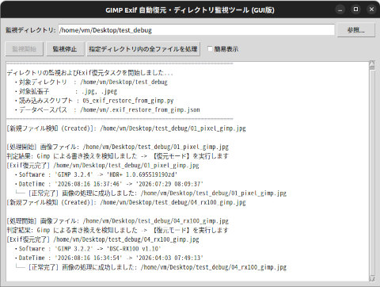

---
[Home](https://oasis3855.github.io/webpage/) > [Software](https://oasis3855.github.io/webpage/software/index.html) > [Software Download](https://oasis3855.github.io/webpage/software/software-download.html) > [image-tools](../README.md) > ***gimp_exif_writeback*** (this page)

 
 

Last Updated : Aug. 2026

 
 

## ソフトウエアのダウンロード

-    [このGitHubリポジトリを参照する](../gimp_exif_writeback/) 

 
 

## 機能の概要

指定ディレクトリを常時監視し、Gimpによる画像編集保存の検出時にExif復元・DB登録処理を全自動実行するPythonスクリプト。

 
 

## 実行画面

## 個別ファイルの説明

- 02_dump_exif_all.py           : テストスクリプト(Exifタグをダンプ表示する)
- 03_edit_exif.py               : テストスクリプト(Exifタグを変更する)
- 04_watch_directory.py         : テストスクリプト(指定したディレクトリを監視する)
- ***05_exif_restore_from_gimp.py***  : Gimpで保存されたExifタグを書き戻すメインスクリプト
- **06_main_watch_and_restore.py**  : コンソール版 Gimpが書き込まれたjpgファイルを監視しExifタグを書き戻すフロントエンドスクリプト
- 07_watch_directory.py         : GUI版 テストスクリプト(指定したディレクトリを監視する)
- **08_main_watch_and_restore.py**  : GUI版 Gimpが書き込まれたjpgファイルを監視しExifタグを書き戻すフロントエンドスクリプト

コンソールで実行する場合に必要なファイルは、05_exif_restore_from_gimp.py と 06_main_watch_and_restore.py である。GUIで実行する場合に必要なファイルは、05_exif_restore_from_gimp.py と 08_main_watch_and_restore.py である。

ユーザが実行するのは06_main_watch_and_restore.pyまたは08_main_watch_and_restore.pyのみであり、05_exif_restore_from_gimp.pyは内部呼び出しで利用される。

 
 

## バージョン履歴

- Version 1.0.0 (2026/08/19) 
    - 06_main_watch_and_restore.py としてテキスト版 最初の実装
- 2.0.0 (2026/08/21)
    - tkinter GUI化
- 2.1.0 (2026/08/22)
    - 指定ディレクトリ内全ファイルの一括自動処理ボタン機能を追加
- 2.2.0 (2026/08/22)
    - 一括処理時のフォルダ選択ダイアログ追加および自動監視停止・再開制御の実装
- 2.3.0 (2026/08/23)
    - 簡易表示（1対象1行表示）のチェックボックス機能を追加

 
 

## ライセンス

このスクリプトは [GNU General Public License v3ライセンスで公開する](https://gpl.mhatta.org/gpl.ja.html) フリーソフトウエア
