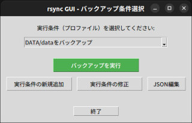
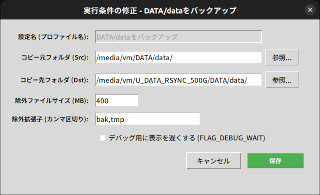
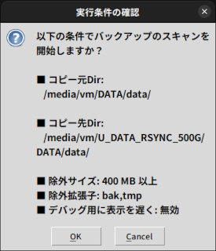
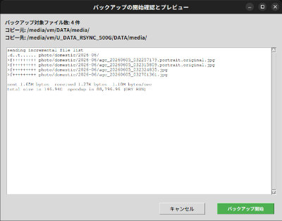

## rsyncバックアップのGUIインターフェース

複数のバックアップ実行条件（プロファイル）をJSONファイルで管理し、選択したプロファイルでrsyncコマンドを実行するためのPythonスクリプト。
実際にバックアップを行う前に、プレビュー画面を表示して転送するファイルなどを確認する機能も実装している。

### 実行例

メインダイアログでプロファイルを選択することができる。また選択中プロファイルの内容を編集したり、新規のプロファイルを作成することもできる。

転送元・転送先のディレクトリ（フルパス）、ファイルサイズでの除外条件、画面表示を少し遅くするディレイ設定などの設定がある。

実行前に選択したプロファイルの内容を確認できる。

プレビュー画面で確認した後、実際のファイル転送が行われる。
